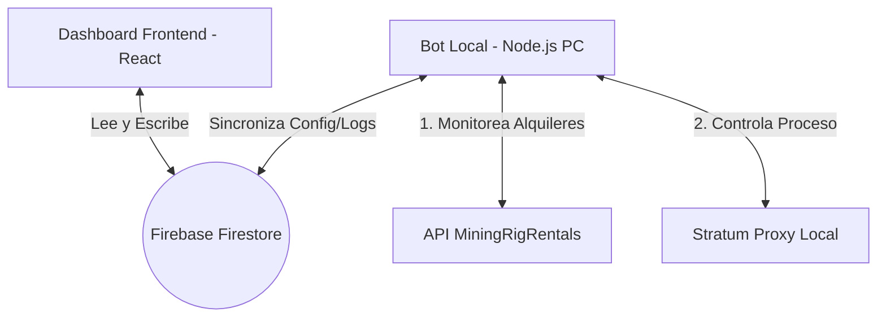

# Plan de Transición de Simulador a Producción Real (H-ARBI)

Este documento detalla la arquitectura necesaria para convertir la plataforma cyberpunk **H-ARBI** de un simulador a un sistema real y funcional, e introduce el código para el bot local de automatización en Node.js.

---

## Arquitectura de Producción: ¿Qué falta para que sea real?

Actualmente, el proyecto frontend corre en modo **Sandbox** (con un simulador que realiza cambios aleatorios en el navegador). Para que sea 100% real, necesitamos tres componentes conectados:

1. **Desactivar el Simulador del Frontend**:
   Cuando Firebase se conecta con credenciales reales, el dashboard de React deja de autogenerar datos simulados y pasa a escuchar colecciones reales en Firestore (`market_cache/realtime` e `history`).
2. **El Bot de Automatización Backend (Local)**:
   Dado que un navegador web no puede controlar procesos del sistema operativo (`stratum-proxy.exe`), el bot en Node.js se ejecuta localmente en tu PC.
3. **Sincronización via Firebase**:
   El bot local lee tus credenciales de MiningRigRentals y la configuración del proxy desde Firebase (configurados en la pestaña **Configuración** del Dashboard), realiza el monitoreo real, controla el proxy localmente, y sube el estado del rig real y las transacciones de arbitraje reales a Firebase para que el Dashboard de React las pinte inmediatamente.

---

## Propuesta de Cambios y Nuevos Archivos

Crearemos un módulo de backend independiente dentro del mismo espacio de trabajo bajo la carpeta `bot/`. Esto evita mezclar dependencias de Node.js de backend con las dependencias de React/Vite de frontend.

### [Componente: Bot de Automatización]

#### [NEW] [index.js](file:///e:/pools%20arbi/bot/index.js)
El script principal del bot. Implementará:
*   Generación de firma HMAC-SHA1 para la API de MiningRigRentals (v2).
*   Bucle de monitoreo inteligente (polling cada 10-15 segundos) con manejo de errores.
*   Lógica de transición entre estados `Available` y `Rented`.
*   Gestión del proceso del Proxy Stratum (Windows) usando `child_process.spawn`.
*   Auto-reinicios en caso de que el proxy se caiga.
*   Consola con logs legibles y timestamps.

#### [NEW] [.env.example](file:///e:/pools%20arbi/bot/.env.example)
Plantilla de variables de entorno locales para configurar credenciales y rutas.

#### [NEW] [package.json](file:///e:/pools%20arbi/bot/package.json)
Configuración de dependencias de Node.js exclusivas para el bot (`axios`, `dotenv`).

---

## Plan de Verificación

### Verificación del Bot Local
1. **Instalación de Dependencias**:
   Ejecutar `npm install` en la carpeta `bot/`.
2. **Prueba de Autenticación de API**:
   Ejecutar el bot en modo depuración para verificar que firme las peticiones correctamente y obtenga respuesta de la API de MiningRigRentals sin errores de credenciales (HTTP 401/403).
3. **Prueba de Control del Proxy**:
   Simular cambios de estado en la API o forzar una respuesta "rented" ficticia para confirmar que el script detecta la transición, mata procesos antiguos de forma segura en Windows y arranca el nuevo proxy con los argumentos adecuados.
4. **Resistencia a Caídas (Crash recovery)**:
   Cerrar manualmente el proceso del proxy desde el Administrador de Tareas para verificar que el bot lo detecte e inicie uno nuevo de forma inmediata.
